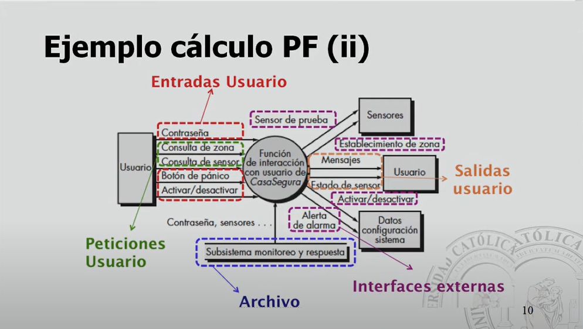
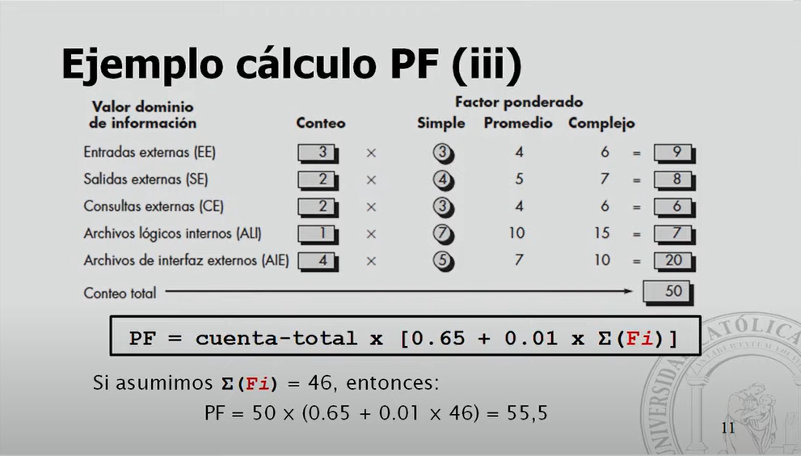

# Puntos de Funcion

Según la metodología de puntos de función de Pressman, cada pregunta se califica en una escala del 0 al 5, donde 0 indica "no aplicable" y 5 indica "muy alta". Aquí están las calificaciones para cada pregunta:

1. ¿El sistema requiere respaldo y recuperación confiables?  
   Calificación: 4

2. ¿Se requieren comunicaciones de datos especializadas para transferir información hacia o desde la aplicación?  
   Calificación: 3

3. ¿Existen funciones de procesamiento distribuidas?  
   Calificación: 3

4. ¿El desempeño es crucial?  
   Calificación: 4

5. ¿El sistema correrá en un entorno operativo existente enormemente utilizado?  
   Calificación: 4

6. ¿El sistema requiere entrada de datos en línea?  
   Calificación: 3

7. ¿La entrada de datos en línea requiere que la transacción de entrada se construya sobre múltiples pantallas u operaciones?  
   Calificación: 4

8. ¿Los ALI se actualizan en línea?  
   Calificación: 3

9. ¿Las entradas, salidas, archivos o consultas son complejos?  
   Calificación: 4

10. ¿El procesamiento interno es complejo?  
   Calificación: 4

11. ¿El código se diseña para ser reutilizable?  
    Calificación: 4

12. ¿La conversión y la instalación se incluyen en el diseño?  
    Calificación: 5

13. ¿El sistema se diseña para instalaciones múltiples en diferentes organizaciones?  
    Calificación: 4

14. ¿La aplicación se diseña para facilitar el cambio y su uso por parte del usuario?  
    Calificación: 4

Sumemos las calificaciones:

\[4 + 3 + 3 + 4 + 4 + 3 + 4 + 3 + 4 + 4 + 4 + 5 + 4 + 4 = 55\]

Por lo tanto, la suma total de las calificaciones es 52.

